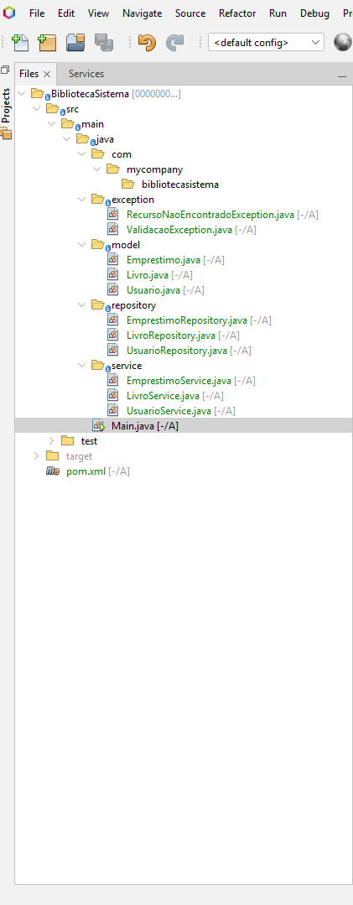
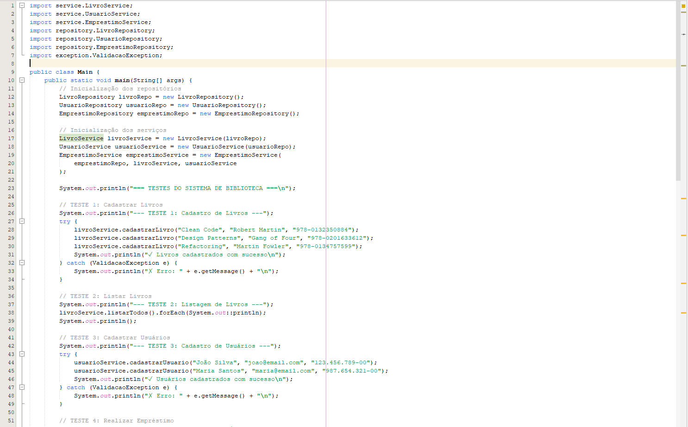
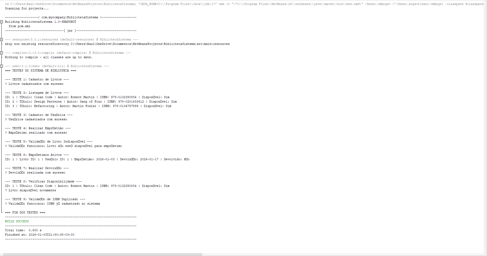

# 📚 Sistema de Gerenciamento de Biblioteca

Sistema desenvolvido como **Projeto Integrador** do curso Técnico em Desenvolvimento de Sistemas do **SENAC**.

## 🎯 Objetivo

Criar um sistema desktop que posteriormente será migrado para ambiente web, aplicando princípios SOLID e boas práticas de programação.

## 🛠️ Tecnologias Utilizadas

- **Java 11+**
- **NetBeans IDE**
- **Git & GitHub**

## 📦 Funcionalidades

✅ Cadastro de livros  
✅ Cadastro de usuários  
✅ Registro de empréstimos  
✅ Controle de devoluções  
✅ Validação de regras de negócio  
✅ Tratamento de exceções  

## 🏗️ Arquitetura

O projeto segue uma arquitetura em camadas:
```
├── model/          → Entidades do domínio
├── repository/     → Camada de persistência
├── service/        → Lógica de negócio
└── exception/      → Exceções personalizadas
```

## 🎓 Princípios Aplicados

- ✅ **Single Responsibility Principle (SRP)**
- ✅ **Open/Closed Principle (OCP)**
- ✅ **Liskov Substitution Principle (LSP)**
- ✅ **Interface Segregation Principle (ISP)**
- ✅ **Dependency Inversion Principle (DIP)**

## 🚀 Como Executar

1. Clone este repositório:
```bash
git clone https://github.com/BERUU1/biblioteca-sistema.git
```

2. Abra o projeto no NetBeans

3. Execute a classe `Main.java`

4. Observe os testes no console

## 📊 Padrões de Projeto

- **Repository Pattern** - Abstração da camada de dados
- **Service Layer Pattern** - Centralização da lógica de negócio
- **DTO Pattern** - Transferência de dados entre camadas

## 📸 Capturas de Tela

### Estrutura do Projeto


### Exemplo de Código


### Testes Executados


## 👨‍💻 Autor

**Raul Vitor Leal Barros**  
Curso: Técnico em Desenvolvimento de Sistemas  
Instituição: SENAC  

## 📝 Licença

Este projeto foi desenvolvido para fins educacionais.
```
